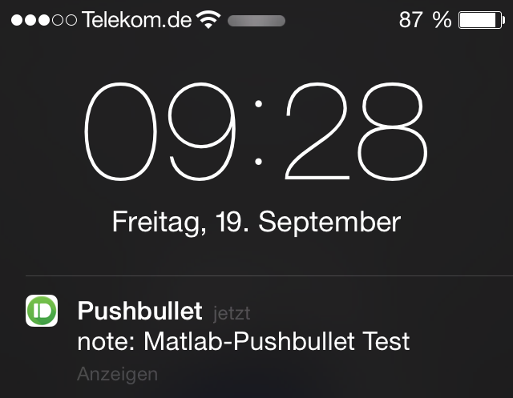

Matlab-Pushbullet
=============

This Matlab class can be used to send push notifications via pushbullet to your smartphone right from within Matlab. 
This could for example inform you that your measurement or simulation is done.

What you need is a Pushbullet Account and the corresponding App for Android or iOS.

In order to use the API you need an API key that can be obtained
[here](https://www.pushbullet.com/account). 



Important: The Matlab class now uses the new webwrite and webread functions from Matlab. The webwrite was introduced in Matlab R2015a. If you are using an older matlab version, use the older release of Matlab-Pushbullet [here](https://github.com/jensb89/Matlab-Pushbullet/releases/).

#Usage


##Initialize object


```matlab
p = Pushbullet(apikey)
```


##Push


##Pushing a text note

```matlab
p.pushNote(device_iden,'Matlab Pushbullet Test','This is the message')
```

##Pushing a link

```matlab
p.pushLink(device_iden, 'Test Link', 'Message to the link', 'http://www.github.com')
```

##Pushing a file

```matlab
p.pushFile(device_iden, file_name, file_type, file_url) 
```
to push a file which has already been uploaded somewhere.

##Pushing to specific devices

`device_iden` can either be `[]` to send a push notification to all the connected devices or the specific device_iden, which can be displayed by:

```matlab
p.load_devices()
```

Furthermore `device_iden` can be an e-mail adress.


License
-------

MIT license. See LICENSE for full text.